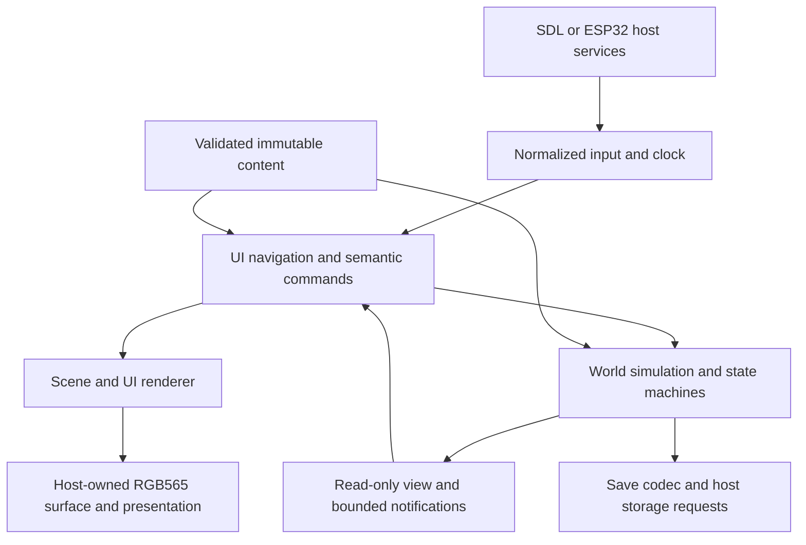

# Summary

Build one portable C11 game shared by SDL and ESP32. Keep simulation, UI, content,
and host services separate. Use fixed pools, typed commands, small state machines,
and immutable content definitions. Author content in JSON and compile a validated
binary pack on the developer machine. The device loads bounded records, not a
JSON tree or scripting runtime.

This is a proposal, not an approved replacement for existing ADRs. The current
shapes demo remains the working baseline. No game systems are implemented by this
RFC. The first playable slice should prove an active pet, a stored companion, two locations, care,
a menu, evolution, offline resume, and save/load before expanding content.

The user selected three gameplay requirements during review: gentle care with
recoverable illness and no permanent death; progression while powered off with
bounded catch-up; and one active pet plus a collection of stored creatures.
The mechanics below implement those requirements as a proposal. Capacity, time
caps, and tuning values remain proposed limits, not measured performance claims.

# Design boundaries

The world owns gameplay truth. The UI requests actions and presents results;
animations never grant items, finish care, or decide evolution. SDK callbacks
cannot modify world state. All gameplay mutation occurs on the engine thread.
Timing, input, drawable memory, presentation, content reads, storage, and optional
host feedback remain injected dependencies.



Proposed module paths describe ownership; create each only with its first use.

| Module | Responsibility | Must not own |
| --- | --- | --- |
| `core/app` | Update order, service binding, boot/recovery | Species rules or SDK setup |
| `core/sim` | World, needs, lifecycle, behavior, commands, interactions | Widgets, file access, display frame rate |
| `core/state` | Small bounded transition helper and typed machine definitions | Arbitrary scripts or recursive transitions |
| `core/content` | Pack validation, IDs, read-only catalogs | Authoring JSON parser or live world mutation |
| `core/ui` | Screen stack, focus, hit testing, view models | Direct need/inventory edits |
| `core/render` | Shapes/sprites/text, clipping, damage, presentation animation | Simulation completion callbacks |
| `core/save` | Versioned encode/decode, migration, snapshot rules | POSIX or ESP storage APIs |
| `tools/content` | JSON validation, reference resolution, pack generation/report | Target runtime behavior |
| `ports/*` | Clocks, event capture, files/flash, display, scheduling | A second gameplay implementation |

Split today's JelliEngine into an app coordinator, world, UI, and renderer state
incrementally. Retain JelliPlatform and JelliSurface boundaries where possible;
add separate content/storage service tables instead of an ever-growing callback
bag. Use caller-owned structs and return typed status codes. Keep shapes mode as
a renderer/input diagnostic while the game uses a separate scene.

# World and content model

Definitions describe types and rules; instances hold changing state. Content IDs
are stable explicit uint32 values, unique within a typed namespace. Names are
human-readable authoring keys resolved by the compiler. Do not derive persisted
IDs from array order or an unchecked string hash. Reserve zero as invalid.

Runtime references use typed slot-and-generation handles. Generation changes on
reuse; stale UI selections, commands, and interactions fail validation. Persist
stable instance IDs and reconstruct handles on load. Prevent generation wrap from
reviving stale handles, for example by retiring a slot until world reload.

| Definition | Authorable data | Instance state |
| --- | --- | --- |
| Species | Traits, allowed forms, preferences, default needs | Species ID, personality seed |
| Form | Life stage, presentation, need rates, capabilities | Form ID, age in stage, unlock flags |
| Evolution rule | Source/target, age window, predicates, priority | Care counters and stage history |
| Object type | Food/toy/medicine/furniture/waste, tags, stack limits, actions | Type ID, quantity or durability, owner/location |
| Location | Background, anchors, adjacency, capacity, environment modifiers | Residents, placed objects, unlocked status |
| Interaction | Participants, guards, duration, cost, effects, interruption policy | Actor/target handles, deadline, reservation |
| Behavior profile | Priority rules, cooldowns, preference weights | Current activity, deadline, cooldowns |
| Screen/menu | Title, item ordering, icons, command IDs, visibility predicates | Selection, scroll position, focused creature |
| Asset/clip | Dimensions, frames, durations, palette and offsets | Playback cursor and bounded tween slots |

Proposed v1 limits: 8 collection entries with exactly one active pet, 32 placed
object instances, 64 inventory stacks, 8 locations, and one primary interaction.
Start content with an active pet, one stored companion, and two locations.
Stored creatures retain identity, form, needs, care history, and PRNG stream but
freeze age, needs, activity timers, and offline progression. Only the active pet
advances, including while menus are open or a different detail screen is shown.
No cross-device multiplayer is implied.

Represent collection membership separately from location occupancy. Each active
creature belongs to exactly one location; stored creatures occupy no scene slot.
An ActivateCreature transaction first requires a completed offline resume and no
running interaction, then freezes the old pet, restores the chosen pet, resets
its time anchor, and updates the selected handle atomically. If the transaction
cannot complete, the original active pet remains unchanged. Force a durable save
request after switching; a recovered older save restores the older complete
selection, never half a switch. Never apply the old pet's offline interval to the
newly selected pet. At least one pet remains active after a successful boot.

Relationship support can initially track a bounded bond with the player. Pairwise
creature relationships and simultaneous social interaction are later extensions,
not a requirement to simulate stored pets. Each object belongs to either an inventory or a
location, never both. A movement action validates adjacency, destination capacity,
and actor eligibility before changing membership atomically.

Stackable inventory and placed objects are distinct bounded stores. Food consumes
a stack; furniture occupies an anchor and exposes actions; toys can lose
condition; waste is a world object produced by a care rule. Unknown object types
or unsupported action kinds are rejected at pack load, not silently ignored.

No generic ECS is needed initially. Typed arrays make capacity, iteration order,
save format, and memory cost explicit. Revisit an ECS only when actual entity
composition makes these arrays hard to maintain.

# Lifecycle, needs, evolution, and behavior

Use orthogonal machines, not one enum containing every possible combination.

| Machine | Initial states | Owner and transition triggers |
| --- | --- | --- |
| App | Boot, LoadContent, LoadSave, Resuming, Playing, RecoverableError | Host service results and user retry/reset |
| Lifecycle | Egg, Baby, Juvenile, Adult, Elder | Age thresholds and evolution rules |
| Health | Well, Unwell, Recovering | Need thresholds with hysteresis; care effects |
| Activity | Idle, Wander, Eat, Play, Sleep, Socialize, React | Commands, behavior choice, deadlines, interruption |
| Interaction | Reserved, Running, Completed, Cancelled | Validated resources and authoritative simulation time |
| UI | Home, Menu, Detail, Confirmation, Notice | Navigation input and command results |

Lifecycle is a forward graph of forms. Multiple forms can share one stage. Reject
cycles in evolution graphs for v1; reversible transformations would be a separate
system. Elder is a stable terminal life stage in the gentle model; needs never cause
permanent death. Retirement and breeding would require separate proposals.

Needs use integer values from 0 to 1000: satiety, energy, hygiene, amusement, and
social comfort. Health and mood derive from explicit rules; do not store redundant
values unless their history matters. Rates use fixed-point integer accumulation
with saved remainders so small drains are independent of update cadence. Saturate
values, widen intermediate arithmetic, and define units in the schema.

Care history records opportunities and responses, not frames spent in a state.
For example, an unmet hunger episode counts once after a configured grace period;
it resets only after recovery above a separate threshold. Store stage-local
feeding, play, illness, and neglect counters with saturation policies.

At an evolution boundary, evaluate bounded predicates against one snapshot of
age, care history, traits, relationship values, and location. Choose the highest
priority matching rule, with rule ID as a deterministic tie-break. Require a
fallback rule for each nonterminal stage. Latch the chosen evolution once; cancel
incompatible interactions, change form, reset stage counters, retain identity and
explicitly documented lifelong fields, then emit a presentation notice.

Behavior selection runs at a slower cadence than motion. Priority is: urgent
health response, mandatory activity continuation, accepted player interaction,
then autonomous choices. Sleep/need thresholds use hysteresis; minimum dwell time
and cooldowns prevent oscillation. Scan a bounded list of candidates, apply
integer preference scores, break ties using a versioned seeded PRNG. Save PRNG
state; seeded replay must not depend on render rate or platform libc rand().

Use the same action execution path for autonomous and player-selected behavior.
Scene movement is initially between authored anchors with bounded interpolation;
pathfinding and physics are not prerequisites for a pet game.

# State machine foundation

Each machine has a typed state enum, a small context, and a bounded transition
table: current state, event kind, guard ID, action ID, next state. Guards are pure;
actions call registered C handlers. Data can select supported handler IDs and
parameters, but cannot supply function pointers or executable expressions.

Process one transition per machine per simulation phase. Entry/exit actions may
queue a later event; they cannot recursively dispatch transitions. Set an explicit
priority for competing events and reject ambiguous tables during content build.
Use terminal-state markers and transition coverage tests. Hierarchy is limited
to one parent level if actually needed; orthogonal machines are composed by the
world coordinator, not an implicit global event bus.

Critical state changes happen directly in a transaction. A full notification
queue must never lose a health transition or consume food without applying its
effect. Presentation events are disposable; the UI can reconstruct truth from a
fresh world view. Distinguish commands, internal transition events, and optional
presentation notifications by type and capacity.

# Input, interactions, and menus

Normalize press, move, release, cancel, and navigation keys to native surface
coordinates plus logical time. Keep one active pointer initially. Ports map SDL
and touch events; shared input code recognizes tap, hold, and drag with configured
thresholds. Pointer capture keeps a release paired with its original target.
Dropping/coalescing move events is safe; an overflow that loses press/release must
cancel the gesture so input cannot remain stuck. Preserve bounded draining.

The UI resolves hit targets and emits semantic commands: SelectCreature,
UseObject, Feed, Play, Clean, Rest, MoveLocation, Interact, or Navigate. Commands
carry sequence, simulation tick, actor/target handles, and payload. Validate all
commands again in the world; disabled menu items are not an authorization check.
Return result codes such as Busy, NoItem, WrongLocation, InvalidTarget, or Full.

For an interaction: validate participants, capabilities, location, resources,
and capacity; reserve required resources; start activity; apply timed effects
exactly once; then release reservations. Choose cost/effect timing per action.
For food, consume and apply nutrition together at the eating event. Cancellation
before that event releases the reservation; after it, no refund is implied. Future multi-creature play would reserve both participants in stable handle order. A creature
can own one primary interaction; reject competing actions instead of accumulating
an unbounded work queue. Shared-object contention uses deterministic ordering.

Use a four-entry screen stack and a fixed modal slot. Proposed navigation:

```text
Home / selected location
  Collection -> Creature detail / needs / lifecycle -> Activate confirmation
  Care menu -> Food / Play / Clean / Rest / Medicine
  Inventory -> Item detail -> Use or Place -> Target selection
  Locations -> Location detail -> Travel
  Settings -> Display / sound capability / save status
```

A modal consumes input before underlying screens. Screen changes cancel pointer
capture; Back closes a modal, pops a screen, then returns Home. A menu may have
more items than visible rows but renders a fixed row pool. Data selects labels,
icons, order, availability rules, and commands; C implements a small set of
screen templates and layout primitives. Keep focus separate from actor identity
so a background evolution cannot accidentally target another creature.

Share the UI across both ports, rendered into the same RGB565 surface. Continue
using LVGL as an ESP32 presentation/input adapter rather than writing menus twice.
Use a small bitmap font and simple icons first. Define a round safe area, clipped
hit targets, readable labels, and explicit feedback for unavailable commands.
Opening ordinary menus does not pause care; an explicit debug pause does.

# Time and deterministic update order

Keep monotonic presentation time separate from saved simulation time. Propose a
100 ms simulation tick, needs/behavior evaluation every simulated second, and
presentation at host cadence. Commands are stamped for a tick when admitted;
replay records that tick, not a raw device timestamp. Integer ticks and a defined
PRNG make equivalent command streams reproducible across hosts.

For each tick: admit commands in sequence order; resolve completion of existing
interactions; apply accepted command transactions; advance needs/care/lifecycle;
select eligible autonomous behavior; publish notifications and a read-only view.
Specify tie rules, including an action completing on the same tick as evolution,
in tests. Retire stale handles before the next command batch.

Run at most eight simulation ticks per host update. Retain a bounded backlog of
at most two seconds; larger gaps enter an explicit resume policy, initially
pausing excess elapsed time and recording a diagnostic. Never spin through hours
of missed ticks. Determinism applies to the admitted tick stream; any discarded
time/resume decision is also recorded for replay. Presentation tweens still use
elapsed milliseconds and clamp, including the existing 300 ms color transition.

Offline progression is a v1 requirement. Add an injected time-anchor service
separate from monotonic now_ms: UTC seconds, validity, source identity, and clock
epoch/uncertainty. Hosts own RTC or other trusted time acquisition. A restarted
monotonic counter does not prove elapsed time. The availability and power-loss
retention of a suitable board time source must be verified before claiming this
works on hardware; network access is not assumed. SDL supplies an injectable
wall clock, with controlled values in tests.

Propose a six-hour offline cap, configurable in content within an engine maximum.
Advance only the pet that was active in the save, using min(valid elapsed, cap).
Stored pets remain frozen and excess elapsed time is forgiven. Reject negative,
invalid, unexpectedly changed clock epochs, or uncertain anchors: retain the save,
apply no estimated care loss, and show a time-unavailable notice. Clock corrections
must not produce repeated rewards or repeated neglect episodes.

Use a documented coarse resume model, not a replay of every 100 ms tick. Propose
at most 360 one-minute segments, with a final partial segment and a hard maximum
of 361. Apply integer need integration and saved remainders; detect threshold,
interaction-completion, and lifecycle crossings in a bounded fixed order. A single
segment can produce at most one lifecycle transition; stage age remainder carries
forward. This is a deliberate offline rule, not a claim of equivalence to all
online micro-interactions. No autonomous use of finite inventory or new social
activities occurs offline. Already running care either completes once according
to its saved effect marker or is cancelled per its authored resume policy.

Process at most eight segments per host update, show a Resuming screen, and defer
player commands until completion. Use the same recoverable illness floor as live
play, no permanent death, and a summarized result notice instead of replaying
hundreds of cosmetic events. Evolving during resume follows the same priority,
fallback, and once-only rules. Mark an active interaction's resume policy in the
content compiler; unsupported policies fail validation.

Build resume state from the last committed snapshot without overwriting it
midway. On completion, save the resulting world and the new wall-clock anchor
as one transaction before entering Playing. If interrupted, restart from the
last valid snapshot and recompute; do not add deltas to partially saved state.
If saving fails, offer retry or an explicitly unsaved session and report that
progress may be lost. Record discarded elapsed time and the resume model version
for diagnosis/replay. Tests cover cap boundaries, changed clocks, stage crossings,
stored pets, repeated boot, and power loss during resume commit.

# Content authoring, compiler, and data loader

Proposed pipeline:

```text
content/*.json + source assets
  -> host-side schema and reference validation
  -> deterministic content compiler
  -> game.pack + manifest + size report
  -> same bounded C loader on SDL and ESP32
  -> immutable catalogs, assets, and resolved IDs
```

Start with JSON and a repository-local Python compiler using standard-library
parsing through the existing uv workflow. Pin its Python environment when added.
Reject duplicate JSON keys, unknown fields, unsupported versions, noninteger
numeric fields, invalid ranges, duplicate IDs, missing references, impossible
capacities, evolution cycles, and unsupported handler IDs. Source JSON remains
the source of truth; generated output belongs in build output. CMake dependencies
must rebuild packs when content, assets, schemas, or compiler code changes.

Authoring sketch (illustrative subset, not a finished schema):

```json
{
  "schema_version": 1,
  "objects": [
    {
      "id": 1001,
      "key": "food.berry",
      "kind": "food",
      "stack_limit": 20,
      "actions": ["eat.berry"]
    }
  ],
  "interactions": [
    {
      "id": 2001,
      "key": "eat.berry",
      "handler": "consume_food",
      "duration_ticks": 10,
      "effects": [{"need": "satiety", "delta": 180}]
    }
  ]
}
```

Rules use bounded all/any groups of typed comparisons and a fixed effect list.
Propose at most eight predicates and four effects per rule, with at most two
predicate-group levels. No loops, recursion, eval, or general bytecode VM. Adding
a species or food should change data only; adding a novel mechanic may add a C
handler plus schema version/capability support and tests.

Pack header: magic, format version, content revision, required engine capability
bits, total byte length, bounded section counts/offsets, and integrity checksum.
Encode little-endian fields explicitly. Do not serialize C structs or cast mapped
bytes to structs. Validate all offset/length arithmetic before reads, section
alignment/overlap rules, string termination/lengths, asset dimensions, counts,
references, and integrity before exposing any catalog. CRC detects corruption;
it is not content authentication. Initial content is local firmware/build input,
not a remotely trusted mod channel.

Inject read_at(offset, buffer, length) and source size through a content service.
SDL reads game.pack; ESP32 embeds the identical bytes as const flash data first.
Decode small tables into caller-owned fixed storage; stream asset records through
bounded scratch buffers. No JSON parsing or heap growth on the device. Return
specific failures with section/record IDs. On failure, show a built-in recovery
screen independent of the pack and keep existing saves intact.

Hot reload is a desktop developer feature after the loader is stable: pause,
validate a candidate in bounded staging storage, reject incompatible live IDs,
swap at a frame boundary, and invalidate views/renderer caches. A failed candidate
leaves the current world/catalog untouched. It is not required in the first slice.

# Persistence and recovery

Save authoritative world state, inventory, locations, IDs, care history, active
interaction progress/reservations, simulation clock, and PRNG state. Rebuild UI,
render caches, handles, and presentation tweens after load. Version save format
separately from content format and game release. Record content revision and the
stable IDs used; define explicit migrations or reject incompatible content with
a recoverable message. Never silently replace a player's save with a new game.

Inject storage requests/completions and two named save slots. Encode a coherent
snapshot into a caller-owned fixed buffer, then let the host persist it outside
the frame-critical path. A worker may own an immutable copy until completion;
it cannot read the live world concurrently. Tag save requests with generation so
an old completion cannot clear a newer dirty state.

Use a bounded, explicit binary codec with lengths, sequence number, checksum, and
commit marker. Write/verify the inactive slot before making it current; boot
selects the newest fully valid slot and falls back after interrupted writes.
Define host durability semantics and power-cut tests before claiming atomic saves.
Keep erase/write policy in the port. Rate-limit autosaves, coalesce dirty changes,
and expose pending/failure state; validate flash endurance and partition space
before choosing the final cadence. Explicit save and safe suspend request a flush.

# Resource and execution budgets

These are starting ceilings to enforce with sizeof checks, compiler reports,
link maps, queue high-water marks, and hardware measurements, not current usage.

| Resource | Proposed initial ceiling / policy |
| --- | --- |
| Mutable world + UI + queues + animation metadata | 32 KiB caller-owned storage, excluding IO buffers |
| Decoded content tables and indexes | 32 KiB caller-owned storage; immutable after load |
| Save snapshot and IO scratch | 16 KiB total, explicitly partitioned, not task-local arrays |
| Initial compiled definitions and simple assets | 64 KiB flash pack; grow only after image/partition review |
| Optional sprite cache | Up to 128 KiB PSRAM, allocated once at host startup when needed |
| Existing two RGB565 frames | 868624 bytes PSRAM; BSP/DMA allocations are additional |
| Command queue / presentation notifications | 32 / 64 fixed entries; reject commands or drop/coalesce cosmetic notices |
| UI stack / active tweens / visible hit targets | 4 / 16 / 32 fixed entries |
| Work per simulation tick | Bounded scans over configured pools and rule caps; no allocation |
| Runtime target | Simulation + UI aim below 2 ms typical; measure worst case separately |

A full pool produces a typed error with no partial mutation. Reject content that
exceeds configured caps at compile time and again at load. Keep large arrays off
stacks; document host storage placement, per-task stack high-water marks, internal
heap minimum, and PSRAM usage. The current application partition is finite;
check the actual generated partition table and linked image before adding assets
or storage. Do not assume 16 MB flash is all available to the application.

Dirty rectangles must include old and new object bounds, text changes, and
screen transitions. Initially union a bounded set of damage into one rectangle;
fall back to a full redraw on screen changes. Preserve the measured MVP motion
baseline, but benchmark menus and multiple creatures before promising 60 FPS.

# Implementation sequence and acceptance

Each milestone produces a runnable vertical increment. Keep strict warnings,
static analysis, size limits, and the existing desktop/core/sanitizer matrix.

| Step | Deliverable | Acceptance gate |
| --- | --- | --- |
| 1. World foundation | Typed IDs/handles, fixed pools, clock/ticks, commands, PRNG, small FSM helper | Deterministic headless replay; stale handles, queue overflow, transition order, and long gaps tested |
| 2. Content pipeline | Minimal schemas/compiler/pack loader; two forms, one food, one location | Byte-identical rebuilds; malformed/truncated/overflow packs rejected; same bytes load on both hosts |
| 3. First pet loop | Egg/baby, needs, feed/rest/clean, activity machine; primitive creature art | Menu command changes world once; needs independent of rendering; save-free loop runs on board |
| 4. Navigation | Shared Home/Care/Detail/Inventory templates, hit testing, Back/confirm | Mouse and touch produce same commands; clipping, cancellation, disabled actions, queue loss tested |
| 5. Persistence and offline time | Snapshot codec, two-slot recovery, time-anchor DI, bounded resume, one migration fixture | Save/load replay matches; power-cut recovery; cap/clock/reset cases pass; board time-source retention verified |
| 6. Evolution | Branching juvenile/adult forms, care history, rule fallback | Boundary/tie/fallback tests; save around evolution cannot apply it twice |
| 7. Collection and locations | Stored companion, activation transaction, second location, player bond, placed objects | Stored pet remains frozen; switching preserves identity; only saved active pet receives offline time; capacity/stale selections tested |
| 8. Presentation and tuning | Sprite clips, mood reactions, data-driven balancing, optional reload | Full-capacity soak tests, measured memory/frame budgets, physical touch confirmation |

Step 1 uses tiny test definitions before the compiler exists. Step 3 can expose
one temporary shared action overlay; Step 4 completes navigation. Build save
contracts early but implement durability after the first playable loop. The first
complete gameplay slice is Steps 1–7 with primitive art, not a large content pack.

Loader/save tests include malformed corpora, truncation at every field boundary,
excess counts, bad references, unknown versions, and bounded fuzz execution under
ASan/UBSan. Simulation tests compare the same tick/command stream at different
render cadences, save/load boundaries, pool capacity, and PRNG seeds. Avoid
bytewise hashing of native structs; hash canonical serialized gameplay fields.
Run both host builds after shared-interface changes; record hardware measurements
and physical input checks separately from compile and CI success.

# Tradeoffs and open decisions

Fixed pools simplify ownership and failure behavior but cap collection size. A
compiled pack adds build tooling but makes device parsing and content budgets
predictable. Shared software UI retains portability but requires a small text and
widget layer; using native LVGL screens would split UI behavior across ports.
Declarative rule limits constrain designers but keep execution bounded. General
scripting, a generic ECS, and a full behavior-tree framework add costs before the
first pet loop proves a need for them.

The three gameplay requirements are confirmed above. Still settle the proposed
six-hour cap, board time source, initial need rates, stage durations, evolution
branches, inventory replenishment, and autosave cadence through implementation
and playtesting. Real-time versus accelerated development profiles should share the
same units and schema; tuning is data, not separate code paths.

Defer simultaneous multi-pet households, breeding/genetics, networking,
downloadable mods, economies, combat,
procedural maps, and complex minigames. Preserve typed interaction/content seams
so these can be proposed later without making them foundation dependencies.

# References

- [Portable engine boundary](../adr/adr-001-portable-c-core-and-host-adapters.md)
- [Injected timing](../adr/adr-002-inject-time-and-keep-pacing-in-hosts.md)
- [Bounded C checks](../adr/adr-007-bounded-c-and-enforced-quality-checks.md)
- [Current animation contract](../adr/adr-009-bounded-input-color-animation.md)
- [Measured rendering baseline](../memos/memo-006-input-animation-and-frame-performance.md)
- [Current engine API](../../include/jelli/engine.h)
