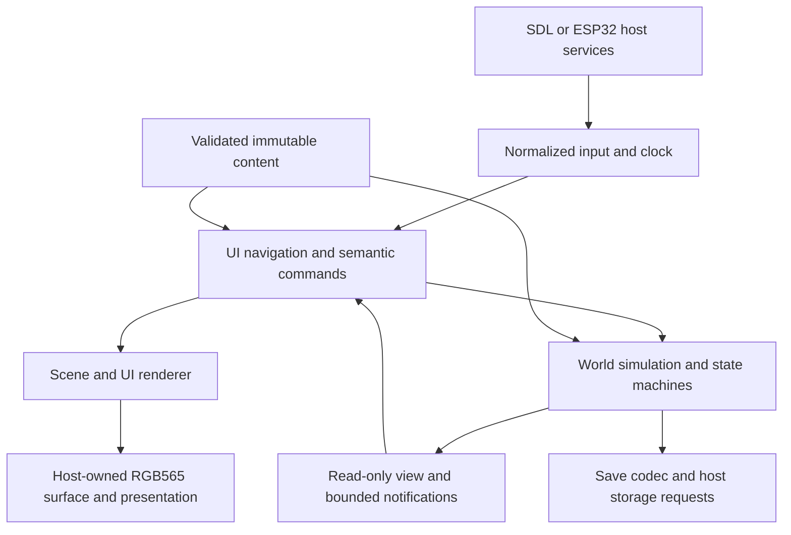

# Summary

Build one portable C11 game shared by SDL and ESP32. Keep simulation, UI, content,
and host services separate. Use fixed pools, typed commands, small state machines,
and immutable content definitions. Prove the care loop with small C definition
tables first. Later, author content in JSON and compile a validated binary pack
on the developer machine. The device loads bounded records, not a JSON tree or
scripting runtime.

This is a proposal, not an approved replacement for existing ADRs. An initial playable subset now exists alongside the original shapes diagnostic;
[memo-008](../memos/memo-008-playable-pet-mvp-and-polish-backlog.md) records
implemented behavior, validation, and deferred work. This draft still describes
the intended architecture beyond that subset. The first playable slice proves one pet in one location: feed, need changes,
illness recovery, sleep/wake, one gift, one earned reward, one evolution, and
save/resume through a small shared care menu. A bounded asset set makes each
state visible without requiring the complete presentation system.
The complete v1 then adds a stored companion and a second location. Collection
remains a requirement; it is not a prerequisite for proving the care loop.

The user selected three gameplay requirements during review: gentle care with
recoverable illness and no permanent death; progression while powered off with
bounded catch-up; and one active pet plus a collection of stored creatures.
The user also requested gifts, other reward mechanics, sleep/wake cycles, and an
asset plan for the vertical slice. Local gifts and a player-set pet routine are
proposed defaults; exchanges between devices and civil-time scheduling are not
confirmed requirements. The mechanics below implement the requirements as a proposal. Capacity, time
caps, and tuning values remain proposed limits, not measured performance claims.

# Design boundaries

The world owns gameplay truth. The UI requests actions and presents results;
animations never grant items, finish care, or decide evolution. SDK callbacks
cannot modify world state. All gameplay mutation occurs on the engine thread.
Timing, input, drawable memory, presentation, content reads, storage, and optional
host feedback remain injected dependencies.



Proposed module paths describe eventual ownership, not required scaffolding.
Start with concrete world, care UI, and save functions alongside the renderer.
Create a module only when implemented behavior needs that boundary; extract a
shared helper only after at least two concrete uses demonstrate the same rules.

| Module | Responsibility | Must not own |
| --- | --- | --- |
| `core/app` | Update order, service binding, boot/recovery | Species rules or SDK setup |
| `core/sim` | World, needs, lifecycle, behavior, commands, interactions | Widgets, file access, display frame rate |
| `core/state` (optional later) | Shared transition helper if concrete machines justify it | Arbitrary scripts or recursive transitions |
| `core/content` | Pack validation, IDs, read-only catalogs | Authoring JSON parser or live world mutation |
| `core/ui` | Screen stack, focus, hit testing, view models | Direct need/inventory edits |
| `core/render` | Shapes/sprites/text, clipping, damage, presentation animation | Simulation completion callbacks |
| `core/save` | Versioned encode/decode, migration, snapshot rules | POSIX or ESP storage APIs |
| `tools/content` | JSON validation, reference resolution, pack generation/report | Target runtime behavior |
| `ports/*` | Clocks, event capture, files/flash, display, scheduling | A second gameplay implementation |

Split today's JelliEngine into an app coordinator, world, UI, and renderer state
incrementally. Retain JelliPlatform and JelliSurface boundaries where possible;
add separate content/storage service tables instead of an ever-growing callback
bag. Use caller-owned structs and return typed status codes. Keep shapes mode as
a renderer/input diagnostic while the game uses a separate scene.

# World and content model

Definitions describe types and rules; instances hold changing state. Content IDs
are stable explicit uint32 values, unique within a typed namespace. Names are
human-readable authoring keys resolved by the compiler. Do not derive persisted
IDs from array order or an unchecked string hash. Reserve zero as invalid.

Runtime references use typed slot-and-generation handles. Generation changes on
reuse; stale UI selections, commands, and interactions fail validation. Persist
stable instance IDs and reconstruct handles on load. Prevent generation wrap from
reviving stale handles, for example by retiring a slot until world reload.

| Definition | Authorable data | Instance state |
| --- | --- | --- |
| Species | Traits, allowed forms, preferences, default needs | Species ID, personality seed |
| Form | Life stage, presentation, need rates, capabilities | Form ID, age in stage, unlock flags |
| Evolution rule | Source/target, age window, predicates, priority | Care counters and stage history |
| Object type | Food/toy/medicine/furniture/waste, tags, stack limits, actions | Type ID, quantity or durability, owner/location |
| Location | Background, anchors, adjacency, capacity, environment modifiers | Residents, placed objects, unlocked status |
| Interaction | Participants, guards, duration, cost, effects, interruption policy | Actor/target handles, deadline, reservation |
| Behavior profile | Priority rules, cooldowns, preference weights | Current activity, deadline, cooldowns |
| Reward rule | Stable ID, scope, qualifying event, target, fixed bundle, repeat cooldown | Progress, occurrence, pending/claimed state, next eligibility |
| Gift | Giftable object ID, allowed recipient traits, bond effect | Reserved inventory quantity and interaction effect marker |
| Sleep profile | Daily window, nap limit, asleep need rates, energy thresholds | Awake/Asleep, reason, local phase, override and nap deadlines |
| Screen/menu | Title, item ordering, icons, command IDs, visibility predicates | Selection, scroll position, focused creature |
| Asset/clip | Dimensions, frames, durations, palette and offsets | Playback cursor and bounded tween slots |

Proposed v1 limits: 8 collection entries with exactly one active pet, 32 placed
object instances, 64 inventory stacks, 8 locations, and one primary interaction.
The complete v1 content has an active pet, one stored companion, and two locations.
Stored creatures retain identity, form, needs, care history, and PRNG stream but
freeze age, needs, activity timers, and offline progression. Only the active pet
advances, including while menus are open or a different detail screen is shown.
Each pet owns a saved uint64 logical clock in 100 ms ticks. Age, activity and
interaction deadlines, cooldowns, recovery dwell, and care grace periods all use
that clock. Save fractional need accumulators and episode latches too. Only the
active pet's clock advances through admitted live ticks or offline segments.
Stored clocks and their absolute local deadlines remain unchanged; activation
needs no deadline rebasing. Wall-clock anchors belong to world snapshots, never
to individual cooldowns. No cross-device multiplayer is implied.

Represent collection membership separately from location occupancy. Each active
creature belongs to exactly one location; stored creatures occupy no scene slot.
An ActivateCreature transaction first requires a completed offline resume and no
running interaction, then freezes the old pet, restores the chosen pet without
advancing its local clock, and updates active identity and scene membership
atomically. Choose a valid destination before committing the switch. If the
transaction cannot complete, the original active pet remains unchanged. Force a durable save
request after switching; a recovered older save restores the older complete
selection, never half a switch. Never apply the old pet's offline interval to the
newly selected pet. At least one pet remains active after a successful boot.

Relationship support can initially track a bounded bond with the player. Pairwise
creature relationships and simultaneous social interaction are later extensions,
not a requirement to simulate stored pets. Each object belongs to either an inventory or a
location, never both. A movement action validates adjacency, destination capacity,
and actor eligibility before changing membership atomically.

Stackable inventory and placed objects are distinct bounded stores. Food consumes
a stack; furniture occupies an anchor and exposes actions; toys can lose
condition; waste is a world object produced by a care rule. Unknown object types
or unsupported action kinds are rejected at pack load, not silently ignored.

No generic ECS is needed initially. Typed arrays make capacity, iteration order,
save format, and memory cost explicit. Revisit an ECS only when actual entity
composition makes these arrays hard to maintain.

# Lifecycle, needs, evolution, and behavior

Use orthogonal machines, not one enum containing every possible combination.

| Machine | Initial states | Owner and transition triggers |
| --- | --- | --- |
| App | Boot, LoadContent, LoadSave, Resuming, Playing, RecoverableError | Host service results and user retry/reset |
| Lifecycle | Egg, Baby, Juvenile, Adult, Elder | Age thresholds and evolution rules |
| Health | Well, Unwell, Recovering | Need thresholds with hysteresis; care effects |
| Activity | Idle, Wander, Eat, Play, Socialize, React | Commands, behavior choice, deadlines, interruption |
| Sleep | Awake, Asleep | Pet-local routine, energy thresholds, Rest/Wake commands |
| Interaction | Reserved, Running, Completed, Cancelled | Validated resources and authoritative simulation time |
| UI | Home, Menu, Detail, Confirmation, Notice | Navigation input and command results |

Lifecycle is a forward graph of forms. Multiple forms can share one stage. Reject
cycles in evolution graphs for v1; reversible transformations would be a separate
system. Elder is a stable terminal life stage in the gentle model; needs never cause
permanent death. Retirement and breeding would require separate proposals.

Needs use integer values from 0 to 1000: satiety, energy, hygiene, amusement, and
social comfort. Health and mood derive from explicit rules; do not store redundant
values unless their history matters. Rates use fixed-point integer accumulation
with saved remainders so small drains are independent of update cadence. Saturate
values, widen intermediate arithmetic, and define units in the schema.

Gentle care requires a recovery path even with zero inventory and every need at
zero. Propose an always-available BasicCare action: it needs no item, currency,
free object slot, or location unlock, and illness never disables it. It may cancel
a cancellable activity, or wait only for an existing interaction's bounded finish.
Its fixed recovery activity raises all five needs to at least their recovery
thresholds and enters Recovering. During its recovery dwell, clamp needs at those
thresholds; completion enters Well. Urgent behavior cannot interrupt it. Every
evolution must preserve BasicCare and its remaining recovery dwell, raising the
protected needs if the new form has higher recovery thresholds. All forms support this
path; content validation rejects missing thresholds or nonpositive/unbounded
recovery durations. Optional food and medicine provide variety or faster care,
but replenishment is not required to escape illness. Cancellation releases this
protection and leaves BasicCare available again. Offline continuation uses the
same saved recovery deadline and protection; no new BasicCare starts offline.

Acceptance starts Unwell with all needs zero, no inventory, and full object pools.
BasicCare must reach Well in bounded simulated time on both hosts, including a
save/load midway through recovery. Exact duration is tuning; reachability is a
required invariant for every valid content profile.

Care history records opportunities and responses, not frames spent in a state.
For example, an unmet hunger episode counts once after a configured grace period;
it resets only after recovery above a separate threshold. Store stage-local
feeding, play, illness, and neglect counters with saturation policies.

At an evolution boundary, evaluate bounded predicates against one snapshot of
age, care history, traits, relationship values, and location. Choose the highest
priority matching rule, with rule ID as a deterministic tie-break. Require a
fallback rule for each nonterminal form. Latch the chosen evolution once; cancel
incompatible interactions, change form, reset stage counters, retain identity and
explicitly documented lifelong fields, then emit a presentation notice.

Behavior selection runs at a slower cadence than motion. Priority is: urgent
health response, mandatory activity continuation, accepted player interaction,
then autonomous choices. Sleep/need thresholds use hysteresis; minimum dwell time
and cooldowns prevent oscillation. Scan a bounded list of candidates, apply
integer preference scores, break ties using a versioned seeded PRNG. Save PRNG
state; seeded replay must not depend on render rate or platform libc rand().

Use the same action execution path for autonomous and player-selected behavior.
Scene movement is initially between authored anchors with bounded interpolation;
pathfinding and physics are not prerequisites for a pet game.

# Gifts and earned rewards

Propose local gifts in both directions: the player offers a giftable inventory
item to the active pet, and the pet presents earned bundles to the player. No
network identity, delivery service, currency, or trading is needed for this slice.
GiveGift validates an awake recipient, preference compatibility, available stock,
and an idle primary interaction. Reserve one item; consume it and apply the bond
change together at the gift effect marker. A refused or pre-effect cancelled gift
consumes nothing. A liked gift may add a cosmetic reaction; that animation never
owns the item transfer. Stored pets must be activated before receiving gifts.

Reward rules consume authoritative outcomes after world transactions, never taps,
menu visits, notifications, or replayed animations. Start with these mechanics:

| Mechanic | Qualifying progress | Reward and repeat policy |
| --- | --- | --- |
| Care milestone | First successful feeding of a hungry pet | One food bundle per pet; repeated feeding while full adds no progress |
| Bond milestone | First crossing of an authored bond threshold | One gift or decoration unlock per pet and threshold |
| Discovery | First visit to an unlocked location or first form reached | One player-scoped cosmetic unlock per stable rule ID |
| Repeatable care goal | Authored set of distinct useful care outcomes | Fixed consumable bundle; one pending occurrence, then a pet-local cooldown |

The slice needs only the first care milestone, one giftable item, and a reward
list with a Claim action. The remaining mechanics extend the same typed records
later. No streak resets, expiring claims, login-day bonuses, or rewards for merely
waking the pet. BasicCare remains free regardless of rewards; repeatedly creating
illness and recovering is not itself a reward trigger. A useful-care event names
the need episode or interaction instance so repeated commands cannot count it
twice. Each rule retains the last counted source identity and a bounded progress
bitset for its required outcomes; event processing is ordered and never replayed
behind the saved command boundary. Gift effects and reward claims cannot recursively trigger other rewards in
the same phase; a bond crossing caused by a gift is evaluated once afterward.

Propose at most 16 reward definitions, each explicitly player- or pet-scoped, with
at most four fixed outputs per bundle. Preallocate one ledger entry for each valid
rule/scope pair, at most 128 entries for eight pets. A player-scoped rule uses one
entry, not an extra entry per pet. Each entry stores progress, monotonic occurrence
number, pending status, and claimed status or next eligibility. Reject content
whose ledger or bundle cannot fit the declared budgets. Initial bundles are fixed,
so opening a screen or restarting cannot reroll a gift.

When a goal completes, latch its pending occurrence in the ledger. Do not allocate
a separate mailbox object. ClaimReward carries rule ID, scope identity, and
occurrence; validate all bundle outputs, stack limits, unlocks, and inventory space
before granting the entire bundle and marking it claimed in one transaction. Full
inventory leaves the claim pending and returns Full; no partial grant or deletion.
Pending claims do not expire. Repeatable progress pauses while a claim is pending;
after claim, start its cooldown from the scope's logical clock, with no missed
occurrences banked. One-time claimed entries never reset on evolution or activation.

Player cooldowns use admitted world simulation time; pet cooldowns use the saved
pet clock. Stored pets earn no new progress. Offline resume can finish a previously
started qualifying interaction or reach a one-time form milestone; it neither
starts care tasks nor invents login rewards. Ledger updates occur before the
resume snapshot commit. Persist ledger and inventory together and request a save
after claims and gift transfers. A power cut may roll back the whole unsaved
transaction, but must not restore an unclaimed reward beside already granted items.
Content migration must preserve rule identity and pending bundle meaning, or reject
the migration explicitly. This local guarantee does not prevent manual save rollback.

# Sleep and wake cycles

Propose a player-set 24-hour pet routine plus optional naps, independent of the
host's screen brightness or power state. Sleep is a separate Awake/Asleep machine;
it does not occupy the primary interaction slot or pause age and lifecycle. Its
phase is derived from the pet's logical clock plus a saved phase offset. Configure
one bedtime and one nonzero sleep duration shorter than 24 hours. This is a pet
routine, not a promise to match civil time after forgiven gaps or collection
storage. Real-world timezone and daylight-saving rules require a separate choice.

At a scheduled bedtime, finish an interaction already running before sleeping;
block new optional play/gift actions while bedtime is pending. If that window
ends before the interaction finishes, discard the pending bedtime. Scheduled
sleep ends at the end of its window even if energy is still low; apply minimum
awake dwell before a later automatic nap. BasicCare always remains available and
takes priority. Sleeping changes need rates: energy rises,
other drains use explicit sleep-profile rates, and autonomous play/wander stops.
Sleep alone does not consume items, cure illness, or award a gift. BasicCare may
wake a pet and retains its recovery protection. Feeding or gifting a sleeping
pet returns Asleep with a Wake action; no implicit item consumption occurs.

Rest requests a nap when awake and free of a conflicting interaction. It ends at
its local deadline or upper energy threshold, whichever comes first. Low energy
may start an automatic nap using hysteresis and a minimum awake dwell; manual
Wake ends sleep immediately and suppresses another automatic nap for that dwell.
Wake during the scheduled window overrides bedtime until the window ends. Editing
the schedule affects future sleep decisions, never rewinds clocks or grants rewards.
A schedule change may alter current sleep at the next update but cannot interrupt
BasicCare or restart a completed interaction.

During sleep, suppress new neglect counts; existing counted episodes remain
latched. On waking, give still-low uncounted needs a fresh grace period, expressed
as a new deadline on the same pet clock. Do not accumulate hidden sleep neglect.
Health still follows need thresholds and BasicCare remains reachable. Stored pets
freeze sleep state, routine phase, and nap deadlines. Activation restores that
state; the player may explicitly Wake them. Switching pets cannot advance sleep
or reward cooldowns. Player-scoped rewards cannot be multiplied by switching.

Apply the same bounded sleep rules offline at each segment endpoint. Integrate
using the starting sleep state, finish existing effects, evaluate needs and
lifecycle, then resolve one sleep transition for the next segment. A bedtime at
20 seconds begins sleep at the 60-second endpoint; the previous state supplies
rates for that entire segment. If both edges of a short sleep window fall inside
one segment, endpoint sampling may skip that sleep; reject routine windows,
awake intervals, and nap limits shorter than 60 seconds in resume model v1.
No missed sleep episodes or wake bonuses accumulate beyond the offline cap.
Invalid time anchors leave saved sleep state and phase unchanged. Tests cover
midnight wrap, manual Wake, exhausted energy, illness while asleep, schedule edits,
stored sleepers, and power cuts before and after a sleep transition.

# State machine foundation

Start with typed state enums and explicit C transition functions for the concrete
care loop. Guards are pure; handlers own bounded mutations. Do not build a generic
transition-table engine as a prerequisite. If repeated machines later justify
one, tables may select registered C guard/action IDs and bounded parameters, never
function pointers or executable expressions. Any such extension needs its own
ambiguity checks and transition coverage before authorable tables are enabled.

Process at most one transition per machine per simulation phase. Entry/exit
handlers cannot recursively dispatch. The coordinator defines phase order and
competing-event priority in code and tests. Keep atomic interaction effects and
lifecycle changes in their owning transactions. Defer hierarchy and queued
internal events until a concrete use defines their capacity and overflow policy.

Critical state changes happen directly in a transaction. A full notification
queue must never lose a health transition or consume food without applying its
effect. Presentation events are disposable; the UI can reconstruct truth from a
fresh world view. Distinguish commands, internal transition events, and optional
presentation notifications by type and capacity.

# Input, interactions, and menus

Normalize press, move, release, cancel, and navigation keys to native surface
coordinates plus logical time. Keep one active pointer initially. Ports map SDL
and touch events; shared input code recognizes tap, hold, and drag with configured
thresholds. Pointer capture keeps a release paired with its original target.
Dropping/coalescing move events is safe; an overflow that loses press/release must
cancel the gesture so input cannot remain stuck. Preserve bounded draining.

The UI resolves hit targets and emits semantic commands: SelectCreature,
UseObject, Feed, Play, Clean, Rest, Wake, SetSleepSchedule, BasicCare, GiveGift,
ClaimReward, MoveLocation, Interact, or Navigate.
Commands carry sequence, simulation tick, actor/target handles, and payload. Validate all
commands again in the world; disabled menu items are not an authorization check.
Return result codes such as Busy, NoItem, WrongLocation, InvalidTarget, or Full.

Replay records use stable instance IDs plus typed content IDs, never runtime
handles. Record admitted tick, sequence, payload, and expected result. Resolve
instance IDs to current handles at replay admission; a missing instance returns
InvalidTarget without substituting the occupant of its former slot. Instance IDs
are never reused within a save lineage; persist the next-ID counter and fail
creation on exhaustion. In-memory queued commands keep their original generation
checks. Snapshot boundaries occur after a command batch, persist the last applied
sequence, and exclude pending commands; replay resumes with subsequent records.
Pending UI commands are cancelled on reload. Test reconstruction with different
slot layouts, deleted targets, and the same canonical outcomes across save/load.

For an interaction: validate participants, capabilities, location, resources,
and capacity; reserve required resources; start activity; apply timed effects
exactly once; then release reservations. Choose cost/effect timing per action.
For food, consume and apply nutrition together at the eating event. Cancellation
before that event releases the reservation; after it, no refund is implied. Future multi-creature play would reserve both participants in stable handle order. A creature
can own one primary interaction; reject competing actions instead of accumulating
an unbounded work queue. Shared-object contention uses deterministic ordering.

Use a four-entry screen stack and a fixed modal slot. Proposed navigation:

```text
Home / selected location
  Collection -> Creature detail / needs / lifecycle -> Activate confirmation
  Care menu -> Basic care / Food / Play / Clean / Rest or Wake / Medicine
  Gifts and rewards -> Give gift / Pending rewards -> Claim
  Inventory -> Item detail -> Use or Place -> Target selection
  Locations -> Location detail -> Travel
  Settings -> Pet sleep routine / Display / sound capability / save status
```

A modal consumes input before underlying screens. Screen changes cancel pointer
capture; Back closes a modal, pops a screen, then returns Home. A menu may have
more items than visible rows but renders a fixed row pool. Begin with one fixed
care menu; defer authorable screens until navigation patterns repeat. Later data
selects labels, icons, order, availability rules, and commands; C implements a small set of
screen templates and layout primitives. Keep focus separate from actor identity
so a background evolution cannot accidentally target another creature.

Share the UI across both ports, rendered into the same RGB565 surface. Continue
using LVGL as an ESP32 presentation/input adapter rather than writing menus twice.
Use a small bitmap font and simple icons first. Define a round safe area, clipped
hit targets, readable labels, and explicit feedback for unavailable commands.
Opening ordinary menus does not pause care; an explicit debug pause does.

# Time and deterministic update order

Keep monotonic presentation time separate from saved simulation time. Propose a
100 ms simulation tick, needs/behavior evaluation every simulated second, and
presentation at host cadence. Commands are stamped for a tick when admitted;
replay records that tick, not a raw device timestamp. Integer ticks and a defined
PRNG make equivalent command streams reproducible across hosts.

For each tick: admit commands in sequence order; resolve completion of existing
interactions; apply accepted command transactions; advance needs/care/lifecycle;
resolve sleep/wake state; evaluate reward progress from completed outcomes;
select eligible awake autonomous behavior; publish notifications and a read-only view.
Specify tie rules, including an action completing on the same tick as evolution,
in tests. Retire stale handles before the next command batch.

Run at most eight simulation ticks per host update. Retain a bounded backlog of
at most two seconds; larger gaps enter an explicit resume policy, initially
pausing excess elapsed time and recording a diagnostic. Never spin through hours
of missed ticks. Determinism applies to the admitted tick stream; any discarded
time/resume decision is also recorded for replay. Presentation tweens still use
elapsed milliseconds and clamp, including the existing 300 ms color transition.

Offline progression is a v1 requirement. Add an injected time-anchor service
separate from monotonic now_ms: paired UTC and monotonic samples, validity,
source identity, and clock epoch/uncertainty. Represent UTC as seconds plus a
millisecond field; report source resolution rather than inventing precision.
Hosts own RTC or other trusted time acquisition. A restarted monotonic counter does not prove elapsed time. The availability and power-loss
retention of a suitable board time source must be verified before claiming this
works on hardware; network access is not assumed. SDL supplies an injectable
wall clock, with controlled values in tests.

Before game-system implementation, run a board time-source feasibility check.
Measure retention across reset, normal shutdown, and removal of main power; record
which backup power is required, how time is initially set without networking,
and how an unset or reset clock is detected. Define the accepted uncertainty bound
from that evidence. If the board cannot supply elapsed time for the required
power-off cases, pause the offline feature and request a hardware or requirement
decision. A time-unavailable notice is failure handling, not fulfillment of the
offline requirement. Core work with fake time can continue independently.

Propose a six-hour engine maximum for offline progress; content may lower the cap.
Advance only the pet that was active in the save, using min(valid elapsed, cap).
Stored pets remain frozen and excess elapsed time is forgiven. Reject negative,
invalid, unexpectedly changed clock epochs, or uncertain anchors: retain the save,
apply no estimated care loss, and show a time-unavailable notice. Clock corrections
must not produce repeated rewards or repeated neglect episodes.

Use resume model v1 with endpoint sampling, not a replay of live ticks. Partition
the accepted interval into full 60-second segments and one final nonempty partial
segment, with a hard maximum of 361 segments. Durations use the pet's 100 ms tick
unit; preserve sub-tick remainder. For each segment, use this fixed order:

1. Advance the pet clock and integrate needs for the segment using the starting
   form and activity rates, saved integer remainders, saturation, and any active
   BasicCare protection. Sleep-specific rates use the starting sleep state. Do not
   start optional autonomous activities or consume inventory.
2. Apply saved interaction effects whose deadlines are now due, once, in authored
   effect order; consume reserved costs with their effects. Complete due activity
   and recovery deadlines. A cancel-on-resume policy instead cancels before the
   first segment, releasing reservations without applying pending effects.
3. Sample needs at the endpoint, update health and episode latches, and record due
   neglect episodes once. A newly observed low need starts its grace period at
   this endpoint; do not infer an earlier crossing. An existing episode whose
   grace expires counts only if still low after step 2. Recovery clears its latch.
4. Evaluate a due evolution against the resulting care snapshot. Apply one chosen
   transition, retain age overshoot, and use the new form's rates next segment.
5. Resolve sleep/wake for the next segment, including wake grace deadlines. Update
   reward ledgers for qualifying completed interactions and one-time milestones;
   never auto-claim a bundle. These changes are included in the resume snapshot.

Effects and thresholds inside a minute are intentionally sampled at its end. For
example, food due at 10 seconds is applied at 60 seconds after integration. If it
restores satiety above recovery, a would-be hunger crossing at 20 seconds records
no new episode. Evolution due at 40 seconds is evaluated last at 60 seconds and
sees that feeding. A final 45-second segment uses the same order at 45 seconds.
Golden tests fix these outcomes, including food, grace, and evolution sharing an
endpoint; this is not equivalence to online micro-interactions.

Every nonterminal form has one age boundary at least 60 seconds after entry and a
fallback at that boundary. Reject shorter durations, including accelerated test
profiles, for this resume version. A valid pre-resume state has stage age below
its next boundary. Since each segment is at most 60 seconds, age overshoot after
one evolution is below the next form's minimum duration. Thus no second evolution
can remain due at the end of a segment, including the last partial segment.
Validate this invariant on load; never carry an already-due transition into Play.
Offline mode starts no new social activity or autonomous inventory use. Saved
interactions support only continue or cancel-on-resume policies in v1; continue
uses saved effect markers, deadlines, reservations, and bounded effect counts.

Process at most eight segments per host update, show a Resuming screen, and defer
player commands until completion. Needs may reach zero, but illness remains
recoverable through BasicCare after resume and never causes permanent death.
Show a summarized result notice instead of hundreds of cosmetic events. Evolving during resume follows the same priority,
fallback, and once-only rules. Mark an active interaction's resume policy in the
content compiler; unsupported policies fail validation.

Build resume state from the last committed snapshot without overwriting it
midway. On completion, save the resulting world and the new wall-clock anchor
as one transaction before entering Playing. The interval ends at the paired
clock sample captured when resume began. Processing time before the final snapshot
cut is forgiven: sample a fresh anchor at that cut and record the excluded interval.
Time after that cut, including waiting for storage, belongs to the next live
interval and follows the bounded backlog policy; never amend an in-flight anchor. If the clock
becomes invalid or changes epoch during resume, discard the candidate and retry
from the committed snapshot under the invalid-clock policy. If interrupted,
restart from the last valid snapshot and recompute; do not add deltas to partially saved state.
If saving fails, offer retry or an explicitly unsaved session and report that
progress may be lost. Record discarded elapsed time and the resume model version
for diagnosis/replay. Tests cover cap boundaries, changed clocks, stage crossings,
stored pets, repeated boot, and power loss during resume commit.

# Content authoring, compiler, and data loader

After the concrete care loop and save/resume acceptance gates pass, introduce
this pipeline only for definitions that the loop already uses:

```text
content/*.json + source assets
  -> host-side schema and reference validation
  -> deterministic content compiler
  -> game.pack + manifest + size report
  -> same bounded C loader on SDL and ESP32
  -> immutable catalogs, assets, and resolved IDs
```

Start with JSON and a repository-local Python compiler using standard-library
parsing through the existing uv workflow. Pin its Python environment when added.
Reject duplicate JSON keys, unknown fields, unsupported versions, noninteger
numeric fields, invalid ranges, duplicate IDs, missing references, impossible
capacities, evolution cycles, and unsupported handler IDs. Source JSON remains
the source of truth; generated output belongs in build output. CMake dependencies
must rebuild packs when content, assets, schemas, or compiler code changes.

Authoring sketch (illustrative subset, not a finished schema):

```json
{
  "schema_version": 1,
  "objects": [
    {
      "id": 1001,
      "key": "food.berry",
      "kind": "food",
      "stack_limit": 20,
      "actions": ["eat.berry"]
    }
  ],
  "interactions": [
    {
      "id": 2001,
      "key": "eat.berry",
      "handler": "consume_food",
      "duration_ticks": 10,
      "effects": [{"need": "satiety", "delta": 180}]
    }
  ]
}
```

Initially use concrete typed rule records for care and evolution. Defer a general
predicate language until those records cannot express required content. A later
extension may use bounded all/any groups and a fixed effect list.
Propose at most eight predicates and four effects per rule, with at most two
predicate-group levels. No loops, recursion, eval, or general bytecode VM. Adding
a species or food should change data only; adding a novel mechanic may add a C
handler plus schema version/capability support and tests.

Pack header: magic, format version, content revision, required engine capability
bits, total byte length, bounded section counts/offsets, and integrity checksum.
Encode little-endian fields explicitly. Do not serialize C structs or cast mapped
bytes to structs. Validate all offset/length arithmetic before reads, section
alignment/overlap rules, string termination/lengths, asset dimensions, counts,
references, and integrity before exposing any catalog. CRC detects corruption;
it is not content authentication. Initial content is local firmware/build input,
not a remotely trusted mod channel.

Inject read_at(offset, buffer, length) and source size through a content service.
SDL reads game.pack; ESP32 embeds the identical bytes as const flash data first.
Decode small tables into caller-owned fixed storage; stream asset records through
bounded scratch buffers. No JSON parsing or heap growth on the device. Return
specific failures with section/record IDs. On failure, show a built-in recovery
screen independent of the pack and keep existing saves intact.

Hot reload is a desktop developer feature after the loader is stable: pause,
validate a candidate in bounded staging storage, reject incompatible live IDs,
swap at a frame boundary, and invalidate views/renderer caches. A failed candidate
leaves the current world/catalog untouched. It is not required in the first slice.

# Persistence and recovery

Save authoritative world state, inventory, locations, IDs, care history, active
interaction progress/reservations, simulation clock, and PRNG state. Include sleep
state, routine configuration/phase, wake overrides, nap deadlines, reward ledgers,
and claim occurrence counters; persist them with inventory and unlock flags. Rebuild UI,
render caches, handles, and presentation tweens after load. Version save format
separately from content format and game release. Record content revision and the
stable IDs used; define explicit migrations or reject incompatible content with
a recoverable message. Never silently replace a player's save with a new game.

Inject storage requests/completions and two named save slots. Encode a coherent
snapshot into a caller-owned fixed buffer, then let the host persist it outside
the frame-critical path. A worker may own an immutable copy until completion;
it cannot read the live world concurrently. Tag save requests with generation so
an old completion cannot clear a newer dirty state. Allow only one write in
flight; retain newer dirty state for the next snapshot, coalescing requests.
Do not reuse the immutable buffer or choose another target slot before completion.

Every save, including activation and explicit saves, captures world state,
simulation tick, active identity, pet clocks, time remainder, and wall-clock
anchor at one engine-thread snapshot cut. Sample paired wall/monotonic time,
process elapsed time through that monotonic sample under the live backlog policy,
and defer the cut across updates until retained whole ticks are drained. Preserve
the fractional tick remainder. The anchor represents this accounted boundary,
never request submission or worker completion. Keep the pair and snapshot bytes
immutable through IO. If a 12:00 snapshot finishes writing at 12:01, its anchor
remains 12:00; recovery starts there and loses any uncommitted player actions.

Discarded live gaps and debug pauses advance the wall anchor without advancing
pet clocks; record these forgiven intervals so they cannot reappear as offline
debt. If the clock pair is invalid or outside the accepted uncertainty, save an
invalid anchor with the coherent world, not an older valid anchor attached to new
state. The next resume then applies no estimated elapsed time. A newly trusted
epoch establishes a fresh anchor without retroactive progression. On uncertain
write completion, read and validate the slots before retrying; do not overwrite a
possibly committed newer slot using stale slot-selection state.

Tests delay worker completion, advance the live world during IO, cross discarded
gaps, change clock epochs, and cut power before/after commit. Assert that anchors
remain tied to their snapshots and recovered intervals are applied at most once.

Use a bounded, explicit binary codec with lengths, sequence number, checksum, and
commit marker. Write/verify the inactive slot before making it current; boot
selects the newest fully valid slot and falls back after interrupted writes.
Define host durability semantics and power-cut tests before claiming atomic saves.
Keep erase/write policy in the port. Rate-limit autosaves, coalesce dirty changes,
and expose pending/failure state; validate flash endurance and partition space
before choosing the final cadence. Explicit save and safe suspend request a flush.

# Resource and execution budgets

These are starting ceilings to enforce with sizeof checks, compiler reports,
link maps, queue high-water marks, and hardware measurements, not current usage.

| Resource | Proposed initial ceiling / policy |
| --- | --- |
| Mutable world + UI + queues + animation metadata | 32 KiB caller-owned storage, excluding IO buffers |
| Decoded content tables and indexes | 32 KiB caller-owned storage; immutable after load |
| Save snapshot and IO scratch | 16 KiB total, explicitly partitioned, not task-local arrays |
| Initial compiled definitions and simple assets | 160 KiB flash pack; see healthy activities and visual pass in memo-015 |
| Optional sprite cache | Up to 128 KiB PSRAM, allocated once at host startup when needed |
| Existing two RGB565 frames | 868624 bytes PSRAM; BSP/DMA allocations are additional |
| Command queue / presentation notifications | 32 / 64 fixed entries; reject commands or drop/coalesce cosmetic notices |
| UI stack / active tweens / visible hit targets | 4 / 16 / 32 fixed entries |
| Reward definitions / ledger entries / bundle outputs | 16 / 128 / 4; included in world, content, and snapshot ceilings |
| Work per simulation tick | Bounded scans over configured pools and rule caps; no allocation |
| Runtime target | Simulation + UI aim below 2 ms typical; measure worst case separately |

A full pool produces a typed error with no partial mutation. Reject content that
exceeds configured caps at compile time and again at load. Keep large arrays off
stacks; document host storage placement, per-task stack high-water marks, internal
heap minimum, and PSRAM usage. The current application partition is finite;
check the actual generated partition table and linked image before adding assets
or storage. Do not assume 16 MB flash is all available to the application.

Dirty rectangles must include old and new object bounds, text changes, and
screen transitions. Initially union a bounded set of damage into one rectangle;
fall back to a full redraw on screen changes. Preserve the measured MVP motion
baseline, but benchmark menus and multiple creatures before promising 60 FPS.

# Vertical slice asset plan

A first review set now exists in [assets/slice](../../assets/slice/README.md):
70 PNGs, a stable manifest, and a local HTML preview/export tool. See
[memo-007](../memos/memo-007-slice-artwork-and-preview.md) for validation and limits.
The shared renderer now embeds these assets. Physical readability review and
completion of the broader gameplay slice remain pending; see
[memo-011](../memos/memo-011-readable-rings-moments-and-particles.md).

The slice must communicate care, illness, recovery, sleep, gifts, rewards, and one
evolution without waiting for a large art library. Use one original creature with
two visibly distinct forms in a small pixel-art set. The proposed baseline is
32 by 32 pixels per creature frame, integer-scaled to 192 by 192 on the 466 by 466
surface. Use a shared limited palette, binary transparency, and nearest-neighbor
scaling. Keep status text beside the art so color or a single pose is never the
only signal. Art direction and exact appearance remain open for user review.

| Asset group | Slice deliverable | How it is used |
| --- | --- | --- |
| Creature | Two forms, six frames each: two idle frames, eating, happy, asleep, unwell | Reuse happy for gifts/reward acknowledgement; recovery uses unwell/idle plus a status label; waking returns to idle |
| Care/navigation icons | Twelve 16 by 16 icons | Basic care, food, play, clean, rest, wake, medicine, gift, reward, inventory, back, confirm; enlarged to 6x where used inside a ring |
| Ring icons | Thirteen 32 by 32 icons | Six category buttons, moment actions, and close affordance; 3x display scale |
| Stat pictograms | Five 32 by 32 images | One sliding progressive tile and a 1–100 score, 100 best |
| Props | Four 24 by 24 images | Food bowl, wrapped present, opened present, simple bed; present opening is cosmetic and never grants its contents |
| Text | One 8 by 12 bitmap font, 96 glyph slots | Initial English labels and digits, rendered at 2x, with 3x creature names and white/shadow headings; validate glyph coverage for every shipped label |
| Healthy activities | Five 32x32 icons | Brushing, medicine, shot, wash, stretch; clickable target above the actor |
| Scene and feedback | Two 64x64 gray vignette backgrounds and five 16x16 magical effect sprites | Packed particles draw masked RGB565 with integer fades; no extra framebuffer |
| Fallback | Built-in missing-art marker and recovery text | Works when the pack fails to load; unknown asset IDs fail validation before play |

Start with authored PNG sources and a small manifest under `assets/slice/`:
`creatures/`, `icons/`, `menus/`, `meters/`, `health/`, `effects/`, `backgrounds/`, `props/`, `font/`, and `assets.json`. Track source images,
palette, frame rectangles, clip durations, pivots, logical bounds, intended scale,
and provenance/license in the repository. Creature frames additionally derive a
bottom contact anchor from their alpha masks: horizontal centroid of the bottom
three opaque rows, vertical lowest opaque edge. The shared renderer aligns this
point across poses; see [memo-014](../memos/memo-014-creature-contact-anchors.md). Full opaque-pixel centroids and alpha bounds are also computed at build time and kept in immutable frame descriptors; open rings center creatures/icons by that centroid. Variable dental routines, namespaced tuning, mood, audio, and companion events are recorded in [memo-016](../memos/memo-016-responsive-pet-routines-and-audio.md). The current action effects, healthy clickers, visual pass, and acceleration findings are recorded in [memo-015](../memos/memo-015-healthy-activities-and-action-audit.md).
Keep an attribution record for each
external source; original art records its author and any source references. Do
not treat generated build output as the editable source or use screenshots as
sprite masters. Preview sheets belong under `build/`, alongside generated output.

A repository-local converter validates dimensions, binary alpha, palette, frame
bounds, clip duration limits, and manifest IDs. If PNG decoding needs Pillow, pin
it in the local Python tool environment when the converter is added. Emit the
same explicit RGB565 pixel bytes plus 1-bit coverage masks first as generated C
fixture arrays, then as pack asset records when the content pipeline lands. Decode
little-endian asset pixels before writing the native-endian surface. Both outputs
share one conversion path and golden pixel fixtures; the early art build does not
require a general content compiler. CMake tracks source/manifest/converter inputs.

The proposed uncompressed flash accounting is deliberately small:

| Payload | Bytes |
| --- | ---: |
| 16 creature frames, 32 x 32, RGB565 plus 1-bit mask | 34,816 |
| 12 icons, 16 x 16, RGB565 plus 1-bit mask | 6,528 |
| 4 props, 24 x 24, RGB565 plus 1-bit mask | 4,896 |
| 13 ring icons, 32 x 32, RGB565 plus 1-bit mask | 28,288 |
| 5 stat pictograms, 32 x 32, RGB565 plus 1-bit mask | 10,880 |
| 9 health icons, 32 x 32, RGB565 plus 1-bit mask | 19,584 |
| 8 effect sprites, 16 x 16, RGB565 plus 1-bit mask | 4,352 |
| 2 backgrounds, 64 x 64, RGB565 plus 1-bit mask | 17,408 |
| 9 collectible prize sprites, 32 x 32, RGB565 plus 1-bit mask | 19,584 |
| 96 glyphs, 8 x 12, 1-bit | 1,152 |
| Definition allowance | 8,192 |
| Headers, indexes, clip metadata, strings, alignment allowance | 4,096 |
| Total planned pack | 159,776 |
| Headroom within the 163,840-byte pack ceiling | 4,064 |

These are payload estimates, not measurements of a linked image. Built-in fallback
art and renderer code add firmware bytes outside the pack. Report generated and
linked sizes; keep decoded metadata inside the 32 KiB content ceiling and reuse a
bounded asset row buffer within the 16 KiB IO allowance. The slice needs no sprite
cache or full-screen background. Any larger art proposal must update this table
and prove the existing flash, scratch, and frame budgets before being accepted.

Deliver assets in two passes. First, distinct placeholder silhouettes and labeled
poses prove every interaction on SDL. Then replace them with reviewed original
pixel art while preserving IDs, bounds, and clips. Freeze this small manifest
before adding collection or location artwork. An art contact sheet and a scripted
SDL walkthrough must show hungry -> fed, ill -> recovering -> well, awake ->
asleep -> awake, gift offered -> consumed, reward pending -> claimed, and the
form change. Verify overflow leaves a reward pending and interrupted animations
cannot repeat a grant. Inspect round-screen clipping, readable text, transparent
edges, old/new damage bounds, and identical timing at different render cadences.
Compare incremental renders to full redraws. Record physical panel readability,
color, and touch-target checks separately from screenshots and firmware builds.

# Implementation sequence and acceptance

Each milestone produces a runnable vertical increment. Keep strict warnings,
static analysis, size limits, and the existing desktop/core/sanitizer matrix.

| Step | Deliverable | Acceptance gate |
| --- | --- | --- |
| 0. Offline feasibility | Board clock retention and initialization experiment | Required power-off cases, uncertainty, and backup supply documented; unsupported cases require a hardware or requirement decision |
| 1. Concrete care loop | One pet/location, C tables, feed/BasicCare, sleep/wake, fixed care menu, placeholder asset set | Zero-item recovery; routine/nap/manual wake rules; fake-time replay, stale handles, overflow and input cancellation; loop runs on board |
| 2. Evolution and first reward | One evolution, gift item, useful-feed milestone and Claim; two-form asset set | Event ties fixed; give/claim once; full inventory preserves pending claim; milestone cannot be farmed by menu/input repetition; asset walkthrough passes |
| 3. Save and resume | Snapshot codec, paired anchors, serialized two-slot writes, endpoint resume, one migration fixture | Delayed IO and power-cut recovery; stable-ID replay across different handle layouts; cap/clock/segment cases; sleep, gifts, claims and recovery across save/load; step 0 hardware gate satisfied |
| 4. Collection and locations | Stored companion, activation, second location; navigation expanded as needed | Stored local clocks, sleep, reward cooldowns, and partly elapsed grace periods remain frozen across save/load and reactivation; only saved active pet receives offline time; capacity failures are atomic |
| 5. Content pipeline | Compile the proven definition records; bounded pack loader | Same rules/outcomes as C fixtures; byte-identical rebuilds; malformed packs rejected; same bytes load on both hosts |
| 6. Content and presentation | Branching forms, bond/discovery/repeatable goals, optional items/placed objects, expanded clips, balancing | BasicCare invariant holds for every profile; full-capacity soak tests, measured memory/frame budgets, physical touch confirmation |

Steps 1–3 are the first playable slice: a concrete feed, need change, illness
recovery, sleep/wake, gift, earned reward, evolution, and save/resume path with
the bounded slice asset set. Step 4 completes the confirmed collection requirement. Authorable menus, generic transition helpers,
general predicates, and hot reload are optional later proposals driven by actual
repetition or content needs; none is a prerequisite for that slice. Keep the
final v1 requirements distinct from the smaller increments that prove them.

Loader/save tests include malformed corpora, truncation at every field boundary,
excess counts, bad references, unknown versions, and bounded fuzz execution under
ASan/UBSan. Simulation tests compare the same tick/command stream at different
render cadences, save/load boundaries, pool capacity, and PRNG seeds. Avoid
bytewise hashing of native structs; hash canonical serialized gameplay fields.
Run both host builds after shared-interface changes; record hardware measurements
and physical input checks separately from compile and CI success.

# Tradeoffs and open decisions

Fixed pools simplify ownership and failure behavior but cap collection size. A
compiled pack adds build tooling but makes device parsing and content budgets
predictable. Shared software UI retains portability but requires a small text and
widget layer; using native LVGL screens would split UI behavior across ports.
Declarative rule limits constrain designers but keep execution bounded. General
scripting, a generic ECS, and a full behavior-tree framework add costs before the
first pet loop proves a need for them.

The gameplay requirements, including gifts/rewards and sleep/wake, are confirmed
above; their specific mechanics and the asset plan remain proposals. Still settle the proposed
six-hour cap, initial need rates, stage durations within the resume constraints,
evolution branches, reward bundles/cooldowns, gift preferences, sleep durations,
optional inventory replenishment, and autosave cadence through
implementation and playtesting. Resolve board time feasibility in step 0. BasicCare
reachability and coherent snapshot anchors are invariants, not tuning decisions.
Real-time versus accelerated development profiles should share the same units and schema; tuning is data, not separate code paths.

Defer simultaneous multi-pet households, breeding/genetics, networking,
downloadable mods, economies, combat,
procedural maps, and complex minigames. Preserve typed interaction/content seams
so these can be proposed later without making them foundation dependencies.

# References

- [Portable engine boundary](../adr/adr-001-portable-c-core-and-host-adapters.md)
- [Injected timing](../adr/adr-002-inject-time-and-keep-pacing-in-hosts.md)
- [Bounded C checks](../adr/adr-007-bounded-c-and-enforced-quality-checks.md)
- [Current animation contract](../adr/adr-009-bounded-input-color-animation.md)
- [Measured rendering baseline](../memos/memo-006-input-animation-and-frame-performance.md)
- [Current engine API](../../include/jelli/engine.h)

# Moments and native feedback follow-up

[PRD-001](../prd/prd-001-moments-and-readable-care.md) records the requested
breakfast, tea, going-out, and movie rituals, clock suggestions, ring drill-down,
and readable need tiles. Current moments reuse existing feed/play/travel actions;
dedicated scenes, distinct effects, rewards, and balance remain future work.
Button feedback uses a fixed 24-slot particle pool, eight bytes per particle,
integer motion, clipped RGB565 drawing, and restoration of damaged scene regions.
It is cosmetic and never grants items or advances the simulation RNG.
